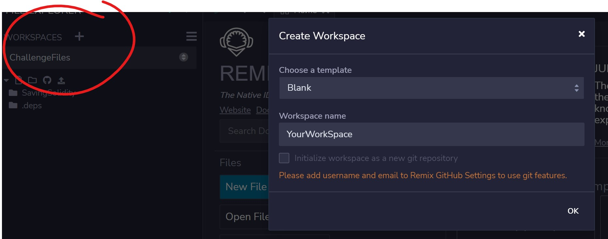
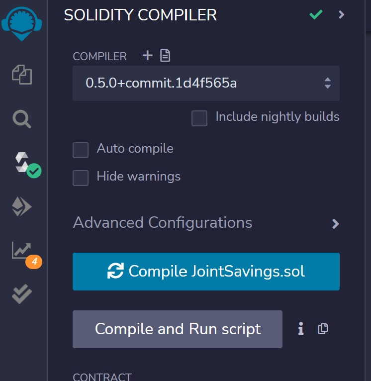
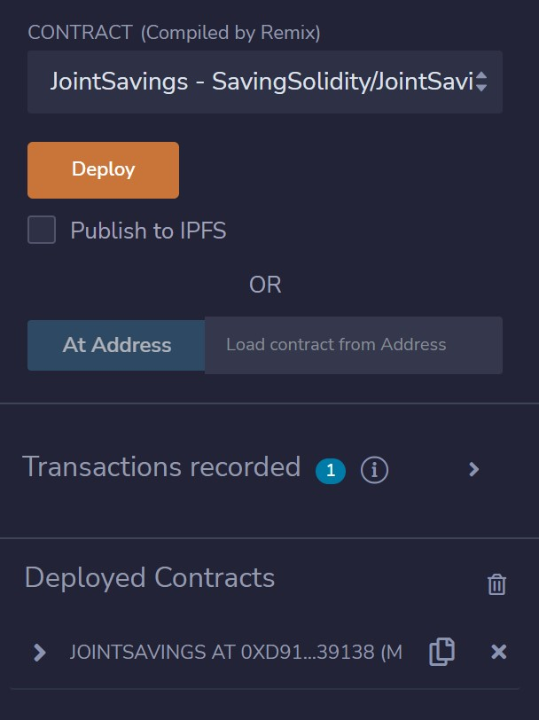
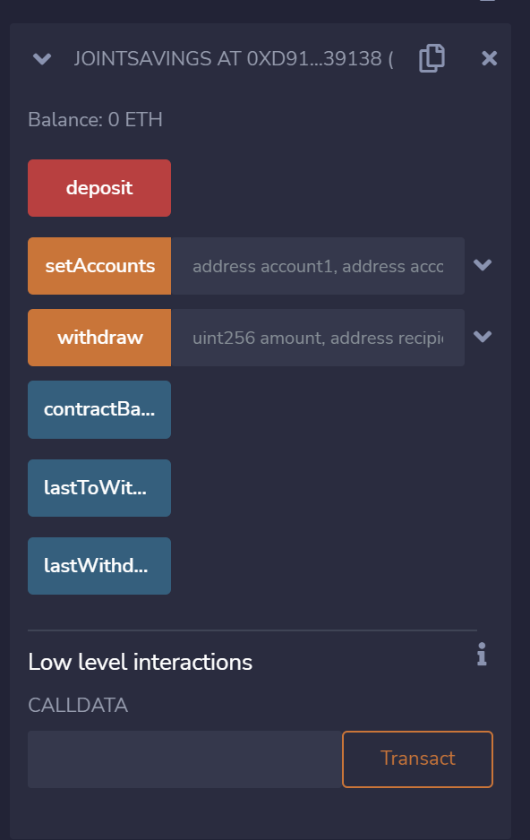
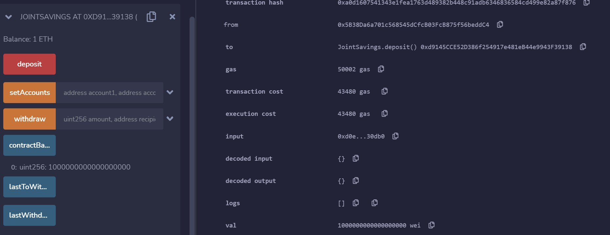
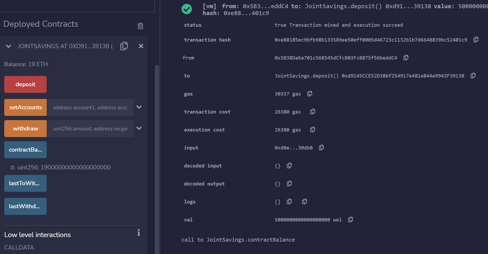
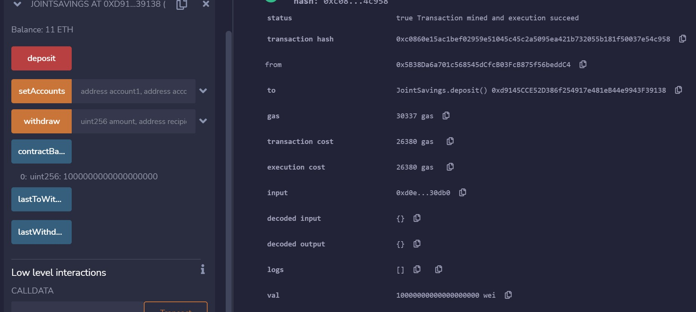
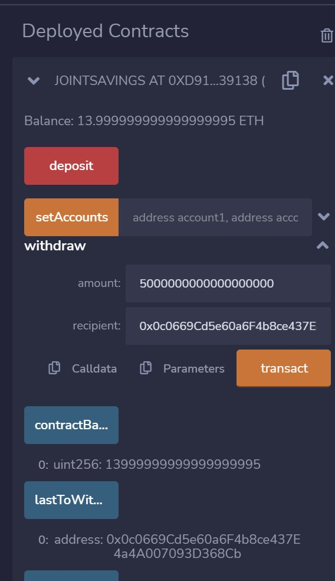
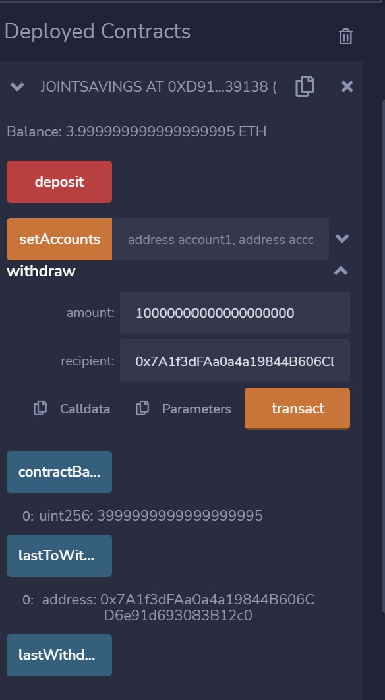

# SavingSolidity
This script creates a joint savings account in the Solidity programming language. This savings account is interactable and can be deployed on the blockchain. Here, I deploy it in a test Javascript Virtual Environment in the Remix IDE. This savings account is restricted to only the two people authorized to make transactions.

---

## Technologies

Language: Solidity 0.5.0

[Remix IDE](https://remix.ethereum.org/) - online integrated development environment for creating and deploying smart contracts

---

# Installation Guide

There is nothing to install! All of the necessary tools are hosted in the Remix IDE. This website even saves local files that have been created after restarting your web browser or computer entirely. 

Simply to go [Remix IDE](https://remix.ethereum.org/) to get started. 

---

## Set Up Your Solidity Development Environment

### Create a Blank Workspace
#### Upload from repo or Create new 'JointSavings.sol' file and copy/paste code from repo

### Ensure Compiler is Set to Version 0.5.0 and Run Compile
**There will be a green check box if compiled successfully**

---

## Deploying and Interacting with a  Smart Contract

### Deploying into Javascript Virtual Machine
#### **Click Deploy**

### Functions available for interaction

---

## Overview 

### Set Accounts

---

### Depositing Ether into Accounts

| One Eth    |Five Eth  | Ten Eth    |
| :-------: | :-----: | :-------: |
| 

 | 

 | 

 |
---

### Withdraw Ether

| Withdraw 5 Eth Account 1    | Withdraw 10 Eth Account 2   |
| :---: | :---: |
| 

 | 

 |

---

## Contributors

Created by Silvano Ross while in the UW FinTech Bootcamp
> Contact Info:
> email: silvanoross3@gmail.com |
> [GitHub](https://github.com/silvanoross) |
> [LinkedIn](https://www.linkedin.com/in/silvano-ross-b6a15a93/)

---

## License

- [MIT](LICENSE)